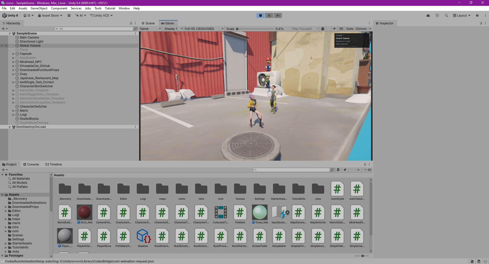
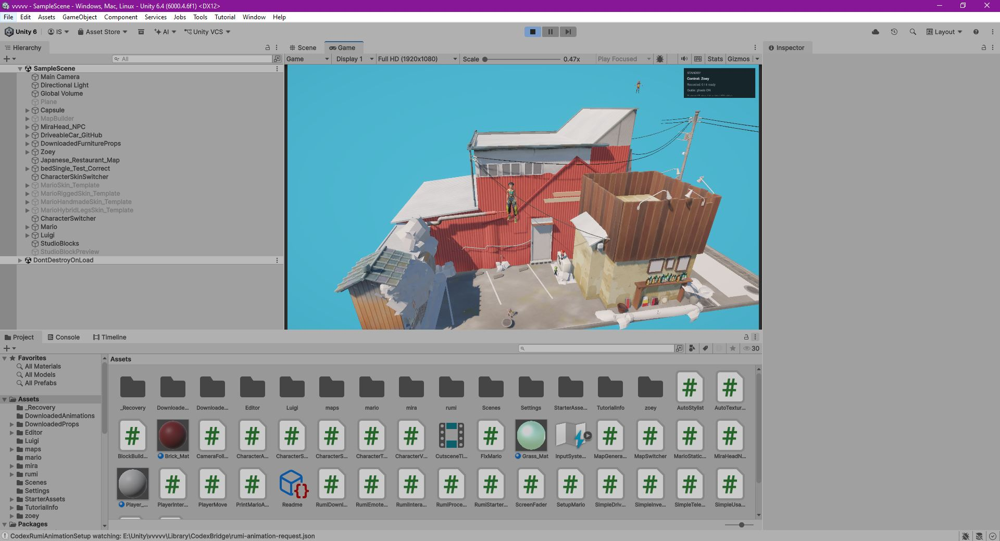
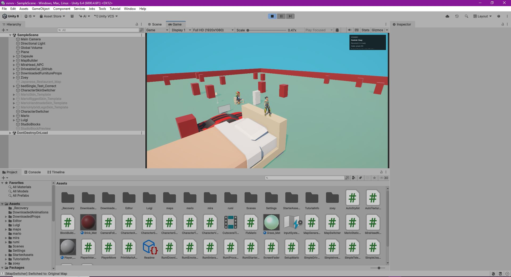
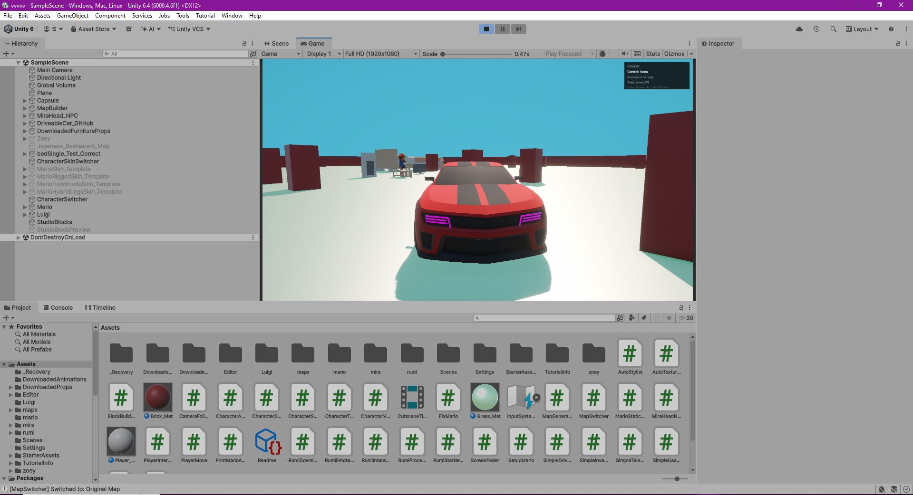
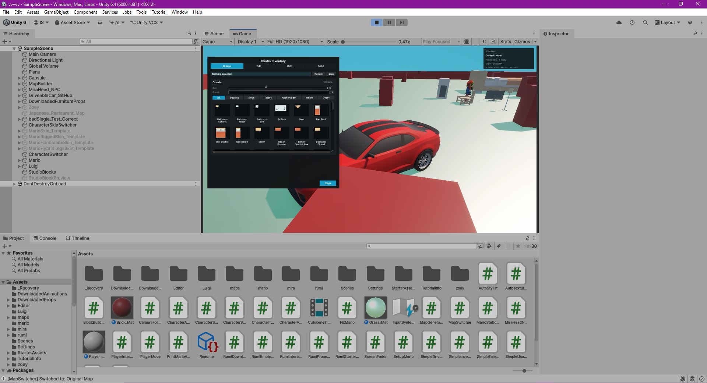
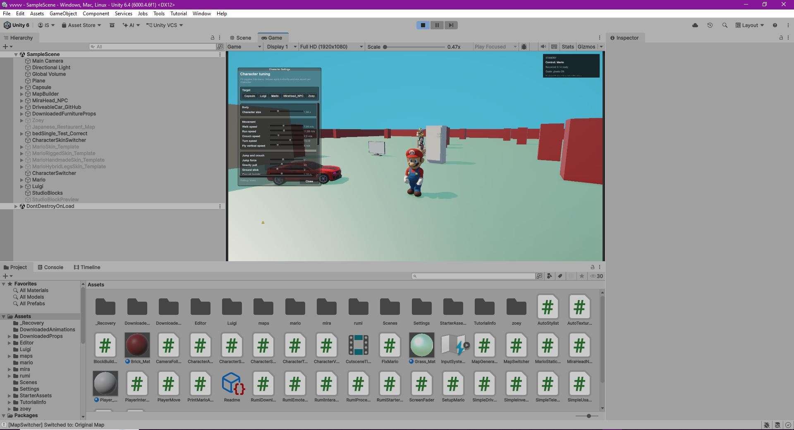
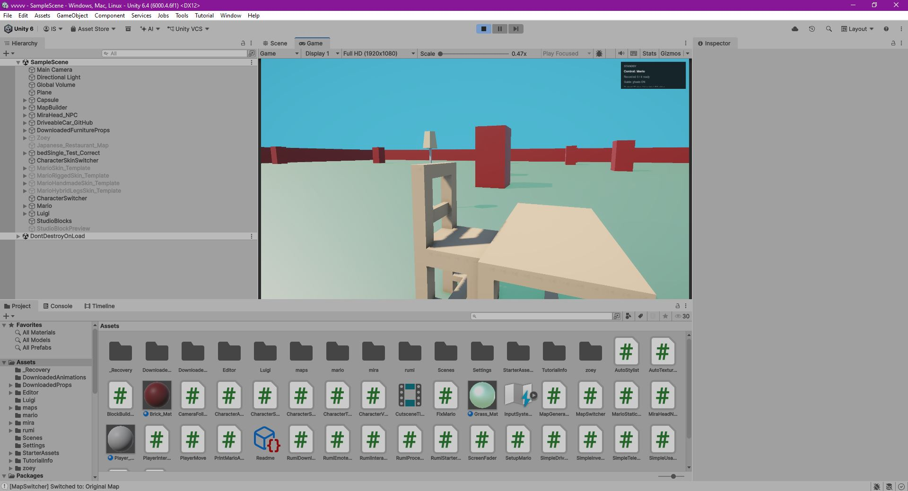

# vvvv Game Studio

An experimental Unity video-studio sandbox for building scenes, controlling multiple characters, placing props, and recording character actions for machinima-style videos and gameplay prototypes.

The project is built around a simple idea: let a creator stage a scene inside Unity like a small virtual studio, then record character takes, camera movement, props, interactions, and small builds without leaving the game.

## Screenshots









## Current Features

- Third-person character movement with walking, running, jumping, crouching, and character switching.
- Multi-character studio workflow for staging scenes with different playable characters.
- Camera follow mode, mouse look, zoom, developer camera, and quick camera recentering.
- Hotkey animation system for dances, poses, gestures, and interaction animations.
- In-game inventory for spawning, selecting, scaling, rotating, and editing scene objects.
- Surface placement mode for putting props on the ground, tables, cubes, and other surfaces.
- Block building mode with previews, colors, undo, and clear actions.
- Usable props such as beds, chairs, bath/toilet style interactions, and other scene furniture.
- Simple driveable car prototype.
- Character action recording and playback workflow for recording separate takes.
- Editor bridge scripts used to automate Unity scene setup, materials, characters, and animation wiring.

## Why This Exists

This project is a prototype toolkit for creators who want to quickly make short videos, gameplay sketches, or AI-assisted Unity experiments. Instead of building every scene manually in the Unity Editor, the user can work inside the game: pick a character, place objects, trigger animations, record a take, switch to another character, and build a staged video scene piece by piece.

## Open Source Value

The useful open-source parts are the Unity/C# systems and workflows:

- runtime character action recording;
- surface-based prop placement;
- in-game inventory and scene editing;
- character switching and skin switching;
- hotkey animation setup;
- block building tools;
- AI-assisted Unity Editor bridge scripts.

These pieces can be reused or studied by Unity creators building machinima tools, sandbox games, prototype studios, or AI-assisted game-development workflows.

## Unity Version

The project was developed with Unity `6000.4.6f1`.

Main scene:

```text
Scenes/SampleScene.unity
```

## Controls

```text
WASD          Move
Shift         Run
Ctrl          Crouch
Space         Jump
Tab           Switch character
Q             Inventory
B             Surface item placement catalog
F2            Block build mode
F3            Recording / studio menu
R             Record a take
F9            Stop / render recording workflow
Mouse wheel   Camera zoom / item scale depending on mode
```

## Roadmap

- Polish the recording workflow into a clearer multi-take timeline.
- Improve generated video export and playback review.
- Add more open-license props and demo scenes.
- Improve inventory UI, thumbnails, filtering, and object scale presets.
- Add documentation for importing characters, animations, props, and maps.
- Separate demo assets from reusable source code more clearly.

## Asset Notice

This repository focuses on the code, tools, and workflow. Some demo assets may be placeholders or user-provided content. For redistribution, production use, or public forks, replace any asset without a clear license with properly licensed content.

